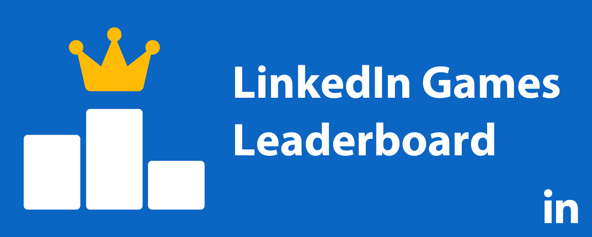

### Description
LinkedIn Games Leaderboard is a [Chrome Extension](https://chrome.google.com/webstore/detail/oninhemoloejgfmakdffidemgijheflf) that generates a daily leaderboard to send to LinkedIn Games groupchats

### Instructions
1. Open your LinkedIn Games groupchat
2. Load all messages from today
3. Click “Generate Leaderboard”
4. Send!

### Features
- Automatically detects chat windows and score messages
- Generates daily leaderboard of all four games (Queens, Tango, Pinpoint, Crossclimb)
- Clean, intuitive interface

### Version History
1.3
- Comprehensive support for score message formats

1.2
- Support for varying sender behaviors

1.1
- Support for varying score message formats
- Improved tiebreaking

1.0 — Initial release
- Basic chat window detection and leaderboard generation
- Support for all four games
- Automated message input
